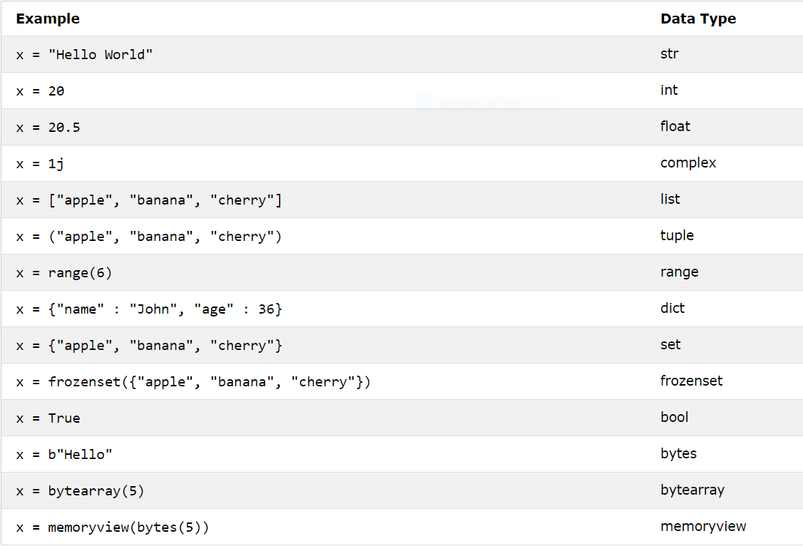
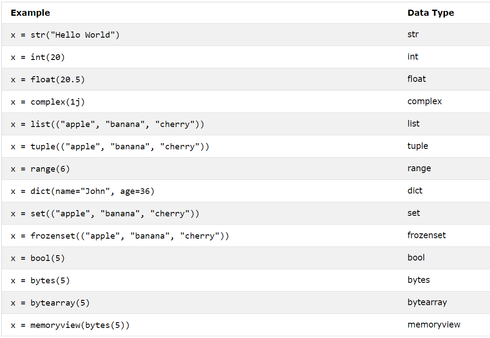

<h1 align="center">Python Basics - Week 2 - Day 3</h1>

## Python For Loops

A for loop is used for iterating over a sequence (that is either a list, a tuple, a dictionary, a set, or a string).

This is less like the for keyword in other programming languages, and works more like an iterator method as found in other object-orientated programming languages.

With the for loop we can execute a set of statements, once for each item in a list, tuple, set etc.

Print each fruit in a fruit list:

```
fruits = ["apple", "banana", "cherry"]
for x in fruits:
  print(x)
```

Looping Through a String
Even strings are iterable objects, they contain a sequence of characters:

```
for x in "banana":
  print(x)
```

### The break Statement

With the break statement we can stop the loop before it has looped through all the items:

Example
Exit the loop when x is "banana":

```
fruits = ["apple", "banana", "cherry"]
for x in fruits:
  print(x)
  if x == "banana":
    break
```

### The continue Statement
With the continue statement we can stop the current iteration of the loop, and continue with the next:

Example
Do not print banana:

```
fruits = ["apple", "banana", "cherry"]
for x in fruits:
  if x == "banana":
    continue
  print(x)
```

## While loop

With the ```while``` loop we can execute a set of statements as long as a condition is true.

```
i = 1
while i < 6:
  print(i)
  i += 1
```
The while loop requires relevant variables to be ready, in this example we need to define an indexing variable, i, which we set to 1.

``` Note: remember to increment i, or else the loop will continue forever. ```

### The break Statement

With the ```break``` statement we can stop the loop even if the while condition is true:

```
i = 1
while i < 6:
  print(i)
  if i == 3:
    break
  i += 1
```

### The continue Statement

With the continue statement we can stop the current iteration, and continue with the next:

```
i = 0
while i < 6:
  i += 1
  if i == 3:
    continue
  print(i)
```

## while..else

 With the else statement we can run a block of code once when the condition no longer is true:

```
 i = 1
while i < 6:
  print(i)
  i += 1
else:
  print("i is no longer less than 6")
```

## Python Datatypes

In programming, data type is an important concept. Variables can store data of different types, and different types can do different things.


<br>

<div align="center">

</div>
<br>

<br>

## Setting the Specific Data Type

<br>


## Python strings

Multiline Strings
You can assign a multiline string to a variable by using three quotes:

```
a = """Lorem ipsum dolor sit amet,
consectetur adipiscing elit,
sed do eiusmod tempor incididunt
ut labore et dolore magna aliqua."""
print(a)
```

### Strings are Arrays

Like many other popular programming languages, strings in Python are arrays of bytes representing unicode characters. However, Python does not have a character data type, a single character is simply a string with a length of 1.

Square brackets can be used to access elements of the string.

```
a = "Hello, World!"
print(a[1])
```

### Looping Through a String

Since strings are arrays, we can loop through the characters in a string, with a for loop.

Example
Loop through the letters in the word "banana":

```
for x in "banana":
  print(x)
```

### String Length

To get the length of a string, use the ```len()``` function.

The len() function returns the length of a string:

```
a = "Hello, World!"
print(len(a))
```

### Check String

To check if a certain phrase or character is present in a string, we can use the keyword in.

Example
Check if "free" is present in the following text:

```
txt = "The best things in life are free!"
print("free" in txt)
```

```
txt = "The best things in life are free!"
if "free" in txt:
  print("Yes, 'free' is present.")
```

### Check if NOT
To check if a certain phrase or character is NOT present in a string, we can use the keyword not in.

Example
Check if "expensive" is NOT present in the following text:

```
txt = "The best things in life are free!"
print("expensive" not in txt)
```

